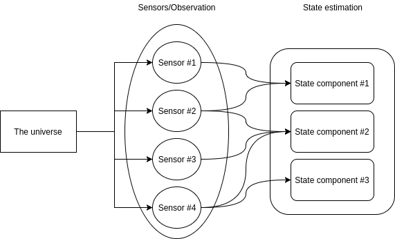
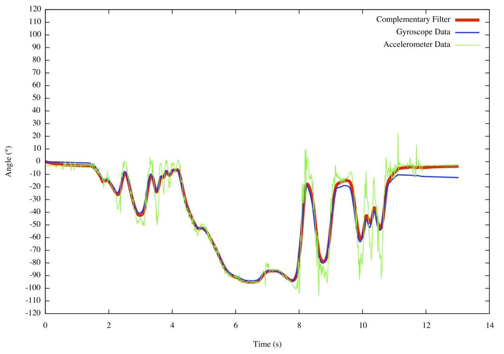
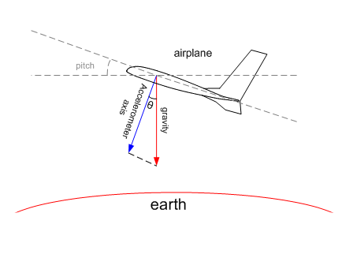
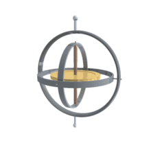
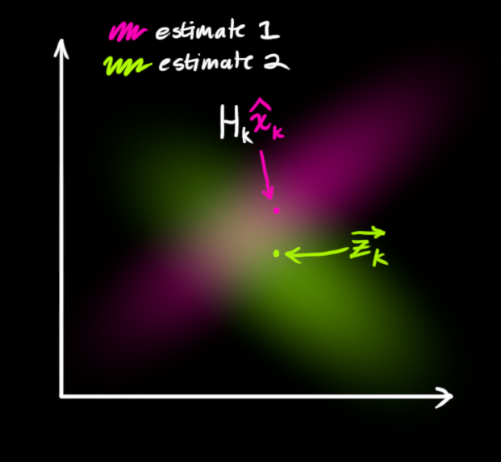

# Spatial and drones

## An exciting target

* Exciting demo for spatial  $\Rightarrow$ Answer to why spatial, and what can spatial do
* Intellectually stimulating $\Rightarrow$ Lots of research on the subject

## Full of potential

Air is still very much an uncharted territory:

* Surveillance
* Search and rescue
* Logistic inside warehouses
* Transport of materials or documents
* Monitoring (crops, protection of species in danger)

# A constrained problem

## Energy bound 

Improved efficiency $\Rightarrow$ Extended flight time

* Hovering rule of thumb: **~150W/Kg**
* A drone like the AF450 from our lab **~100W**
* His FMU (Flight Management Unit), a Pixhawk: **~1-2W**
* Jetson TX2, the latest embedded CUDA board from NVIDIA consumes around: **~8W**

[comment]: # (http://www.starlino.com/power2thrust.html)

## Latency bound

**SLAM** (Software localization and mapping) is critical for **motion planning** and **motion control**.

A critical subproblem of **SLAM** is **POSE** (position estimation)

## 

$$\hat{x_t} = f(x_{t-1}, O_t)$$

* $x_t$ is the state of the drone (including position, attitude (orientation), velocity, etc ...) at time t
* $\hat{x}$ is the estimation of that state
* $O_t$ is the observation of the universe by the drone at time t
* $f$ is the SLAM prediction algorithm

## Goal

Latency = $\Delta t$ = Max($f$ time, $O$ sample rate)

Reduce $f$ computation time closer to $O$ sample rate.

##

Reduced latency result in more accurate $\hat{x_t}$:

* Smoother control $\Rightarrow$ Less jiggering + "agile" drone
* Better sync between planning and control
* Better collision avoidance $\Rightarrow$ safer for the drone and its surrounding.

## Performance bound

Currently, heavy tasks are usually done:

* On a companion computer on the ground
* Sometimes, offline (after the flight) from the data gathered

Preferable or critical to do them **onboard** and **online**

## The vision

**Accelerating hardware! **

*(A plasticine in every drone)*

* Efficient
* Low-latency
* Performant

Focus on **FPGA** and likely the **OcPoc** from aerotenna which include a **cyclone V**.

## 

* Plasticine: An hardware architecture made by us for spatial
* FPGA: A common reprogrammable hardware achitecture targetable by spatial
* Spatial: the compiler from DSL to spatial hardware architecture program

# Sensor fusion

## Sensor fusion

Sensor fusion is the fusion of the data from different sensors to get the accurate estimator of one state.

* Dual GPS
* accelerometer + gyroscope for attitude
* LIDAR + IMU

Sensor fusion can be achieved through the combination of filtered signals.

##

## Sensor Filters

There is two main filters for POSE:

* Complementary filters
* Kalman filters

## Complementary filters

Complementary filters come from the complentarity of a HPF and a LPF applied to different sensors

For instance, retrieving the attitude/orientation from the gyroscope + accelerometer

##

## Accelerometer

accelerometer (through g acceleration) no drift but high-variance at high frequency (vibrations, other forces)

Accurate in the long-term: **Low-pass filter**

## Gyroscope

gyroscope drift (because of integral over numerical error accumulate) 

Accurate in the short term: **High-pass filter**

## Drift

* Why does the gyro drift ? Because of the nature of an integration over a gaussian.
* Even if the noise (sensor noise + floating point error) has no bias, it accumulates errors over time.
* Even if there is no error, the integration is discrete $\Rightarrow$ approximation errors
* $$Z \sim N(\mu_X + \mu_Y, \sigma_X^2 + \sigma_Y^2)$$
* For better intuition, see Wiener process $Var(W_t) = t$

## Kalman Filters

Also called linear quadratic estimation (LQE)

Estimate the joint state random variables (like position) conditonned on a serie of noisy observation (from the sensors).

##

Basic principle, true state $\mathbf{x}_t$ is a linear noisy process:

$$\mathbf{x}_t = \mathbf{F}_t \mathbf{x}_{t-1} + \mathbf{B}_t \mathbf{u}_t + \mathbf{w}_t $$

* $\mathbf{F}_t$ the state transition model
* $\mathbf{B}_t$ the control-input model
* $\mathbf{u}_t$ the control vector
* $\mathbf{w}_t$ process noise drawn from $\mathbf{w}_t \sim N(0, \mathbf{Q}_k)$

##

The kalman filter keeps track of our estimation of the gaussian random variable $X_t$

($[]_{a|b}$ reads as at time a knowing all observations until and including b)

$$\mathbf{X}_{t|t-1} \sim N(\hat{\mathbf{x}}_{t|t-1}, \mathbf{P}_{t|t-1})$$

* $\mathbf{X}$ state gaussian random variable
* $\hat{\mathbf{x}}$ estimated state mean (best guess)
* $\mathbf{P}$ estimated covariance matrix 

##

Kalman filter proceed in two steps, predict and update:

**Predict**:

*  $\hat{\mathbf{x}}_{t\mid t-1} = \mathbf{F}_k\hat{\mathbf{x}}_{t-1\mid t-1} + \mathbf{B}_t \mathbf{u}_t$
* $\mathbf{P}_{t\mid t-1} =  \mathbf{F}_t \mathbf{P}_{t-1\mid t-1} \mathbf{F}_t^\mathrm{T} + \mathbf{Q}_t$

## A simple example

A robot position and velocity in 1D.

* $\mathbf{x}_t = (p_t, v_t)$
* $p_t = p_{t-1} + v_t \Delta t + \frac{1}{2} a \Delta t^2$ 
* $v_t = v_{t-1} + a \Delta t$
* $F_t = (1, \Delta t)^t$ 
* $B_t = (\frac{1}{2} \Delta t^2, \Delta t)^t$
* $u_t = a$

##

Our sensor data $z_k$ is also noisy. We assume error is gaussian.

We get a **likelihood** gaussian distribution:

$$\mathbf{Z}_t \sim N(\mathbf{z}_t, \mathbf{R}_t)$$

* $\mathbf{Z}_t$ the random variable of the sensor data at time t
* $\mathbf{z}_t$ the data returned by the sensor at time t
* $\mathbf{R}_t$ the covariance matrix noise from the sensor (known)

## 

**Prior**: $\mathbf{X}_{t|t-1} \sim N(\hat{\mathbf{x}}_{t|t-1}, \mathbf{P}_{t|t-1})$

Now it suffices to combines them to get the **posterior**
$$P(\mathbf{X}_{t|t}) \propto P(\mathbf{X}_{t|t-1}) \cdot P(\mathbf{Z}_t)$$
$$\mathbf{X}_{t|t-1} \cdot \mathbf{Z}_t \sim ?$$

##

* $\mu’ = \mu_0 + \frac{\sigma_0^2 (\mu_1 – \mu_0)} {\sigma_0^2 + \sigma_1^2}$
* ${\sigma’}^2 = \sigma_0^2 – \frac{\sigma_0^4} {\sigma_0^2 + \sigma_1^2}$

## Update 
* $\mathbf{H}_t$ is the obs matrix (obs to state mapping)
* Innovation or measurement residual: $\tilde{\mathbf{y}}_t = \mathbf{z}_t - \mathbf{H}_t\hat{\mathbf{x}}_{t\mid t-1}$
* Innovation covariance: $\mathbf{S}_t = \mathbf{H}_t \mathbf{P}_{t\mid t-1} \mathbf{H}_t^\mathrm{T} + \mathbf{R}_t$
* Optimal Kalman gain: 
$\mathbf{K}_t = \mathbf{P}_{t\mid t-1}\mathbf{H}_t^\mathrm{T} \mathbf{S}_t^{-1}$
* Updated (a posteriori) state estimate: 
$\hat{\mathbf{x}}_{t\mid t} = \hat{\mathbf{x}}_{t\mid t-1} + \mathbf{K}_t\tilde{\mathbf{y}}_t$
* Updated (a posteriori) estimate covariance $\mathbf{P}_{t|t} = (\mathbf{I} - \mathbf{K}_t \mathbf{H}_t) \mathbf{P}_{t|t-1}$

##

##

The random variables we are interested in here are:

* **position** (x, y, z)
* **attitude** (orientation)
* **velocity**
* **angular velocity**
* **sensor biases**
* Earth magnetic field components

(In bold the ones I will focus on for this project)

##

The observations can come under many form:

* **motion capture systems like Vicon** (output relative position from 6 cameras around the lab tracking some markers)
* **acceleratometer** (for linear velocity)
* **gyroscope** (for angular velocity)
* magnetometer
* GPS
* Optical flow (camera with some points as referentials)
* LIDAR for altitude or cloudpoints

(In bold the ones I will focus on for this project)

## Non-linearity

Rotations are non-linear operations so we cannot just apply vanilla KF.

Because $Cov(f(X))$ for an arbitrary f has no closed form solution.

**Differentiation to the rescue!**

## Extended Kalman Filter

Extended Kalman filter are an extension of kalman filters for **non linear systems**.

F and H are linearized by an approximation of the first order using Jacobians:

* $\hat{\boldsymbol{x}}_{k|k-1} = f(\hat{\boldsymbol{x}}_{k-1|k-1}, \boldsymbol{u}_{k-1})$
* $\tilde{\boldsymbol{y}}_{k} = \boldsymbol{z}_{k} - h(\hat{\boldsymbol{x}}_{k|k-1})$
* ${{\boldsymbol{F}_{k-1}}} = \left . \frac{\partial f}{\partial \boldsymbol{x} } \right \vert _{\hat{\boldsymbol{x}}_{k-1|k-1},\boldsymbol{u}_{k-1}}$
* ${{\boldsymbol{H}_{k}}} = \left . \frac{\partial h}{\partial \boldsymbol{x} } \right \vert _{\hat{\boldsymbol{x}}_{k|k-1}}$

## Quaternions (optional)

Quaternions are an extensions of complex numbers but with 2 extra dimensions 
$$i^2=j^2=j^2=ijk=-1$$

Unit quaternions, also known as versors, can be used to represent orientations and rotations in 3D.

Compared to Euler Angles, they are easier to compose and avoid gimbal lock.

# Extensions 

## Parallelizable, Pipelinable ?

Matrixes involved are small and some known in advance. 

Unrolling and parallelizing potential to shorten latency time.

Investigate theorotical implication of pipelining by using $$\mathbf{X}_{t|t-k}$$ with k the length of the pipeline.

## Other applications

* VR headsets also include an IMU whose reactivity is crucial for immersion
* Not only drones but the whole field of robotic use kalman filter for various planning tasks.
