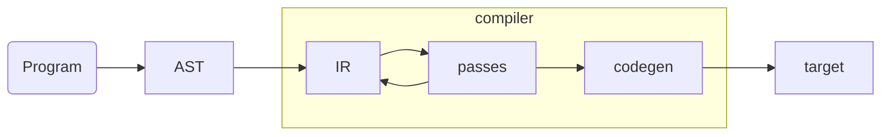
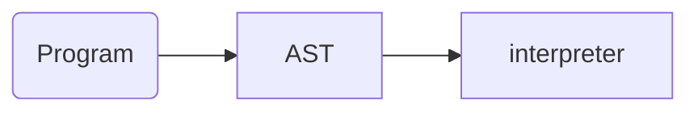
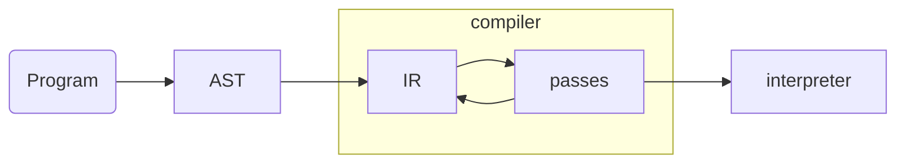
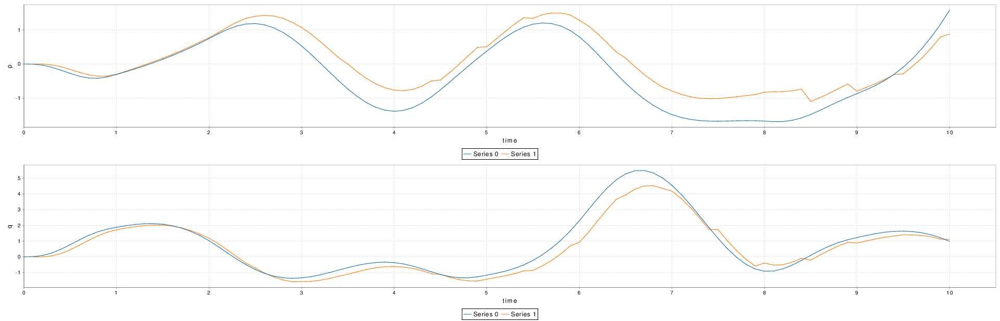

# Outline

- built an interpreter for spatial: **why ? how ? show me**
- integrated spatial with **scala-flow**, another tool I built: **what is scala-flow ? what are the benefits of spatial integration**

	
# Preliminaries

## compiler

* A **compiler** transforms a program from a **source** language to a **target** language
* Usually the target program is of a lower level and in a form that can be more "easily" executed (native code or bytecode).
* A **transpiler** is a kind of compiler that does not lower the language level (java -> scala)

# 



# interpreter

* An interpreter executes a source program directly without any IR transformation. It *interprets* it.



* An interpreter has less coupling needed, it is easier to write than a compiler.
* **python** is an interpreted language

# Recap

- Spatial is an embedded *Domain specific language* (DSL) in Scala
- Compromise between a dedicated language and a library
- We can leverage the full power of scala for meta-programming :)
- For simulation, we codegen to scala and run the scala

# Problems 

- scala AST is not the spatial AST
- Spatial is a hardware **description** language. It does not translate trivially to instructions, this is the task of the compiler !

# Our way

* we compile **and then** interpret the resulting IR
* similar to the scala REPL which wraps all input into a template, compiles it and then executes it.

# 



# It works !

[](https://asciinema.org/a/p8Mg8WK689RXG0MhO1ggoBIyi)

# 

- Run any app in the interpreter with "--interpreter"
- For streaming apps, in memory transfers of input and output streams! Seamless integration with other development tool.

# Advantages 

- More immediate feedback, write and run
- faster than codegen + scala run because less overhead
- ability to inspect the full state of the interpreter at each instruction
- breakpoint and exit nodes

#

[](https://asciinema.org/a/twkwh0Wt2vAjMQFLu6fqGVWK7)

# Sky is the limit

- embed spatial in other libraries ! (scala-flow!)
- interpret spatial code in a webapp using scala.js ?

# scala-flow

- scala-flow is a simulation and prototyping tool for data-flows with spatial integration
- Useful to write complex applications: originl motivation is because particle filters are not easy to debug
- scala-flow is typesafe and has a compositional/functionnal API.

# 

[](https://asciinema.org/a/YCr4mxI2j90T0alUHZzHY56vv)

# Important concepts

* The data flow is made of connected nodes.
* Nodes broadcast packets to the forward nodes at given virtual times
* Scheduler enforce that every packet is sent at the right virtual time and in the order
* Source emit packets, sink consume nodes

# Input and output nodes

- Input nodes can be clocks that emit packets at a regular interval
- Output nodes can be plots that show multiple timeseries coming from different nodes, calculate the RMSE, simply display the content, etc ...



#

```
val sa: Source[A]
val sb: Source[B]
val sla: Source[List[A]]
def f(x: A): C
def b(x: A): Boolean

sa.map(f): Source[C]
sa.zip(sb): Source[(A, B)]
sab.unzip: (Source[A], Source[B])
sa.merge(sb): Source[Either[A, B]]
sa.fusion(sa): Source[A]
sa.foreach(f): Source[A]
sa.filter(b): Source[A]
sa.drop(n): Source[A]
sa.accumulate(clock): Source[List[A]]
sa.groupBy(A => B): Source[(B, A)]
sla.reduce(r): Source[A]
sa.takeWhile(b): Source[A]
sa.muted: Source[B]
sa.toTime: Source[Time]
sa.latency: Source[A]
sa.debug //print packets as they arrive
//and more ...
composable
sa.zip(sb).map(g).filter(c) ...
```


# Simulation

* possible to simulate fixed and random delays
* packets store the time they were initially emitted and, separately all the delays they encountered

# Buffering

Loop are possible through lazy val

```
val sa: Source[A]
def f(x: Source[(A, A)])
lazy val zp = sa.zip(buffer).map(f)
lazy val buffer = Buffer(zp)
def out = zp
```

# Spatial


# Batch 

* To integrate with spatial, we need some node to **batch process** the inputs instead of treating them as they arrive.
* To achieve that, we use multiple scheduler one for each batch and chain them
* **Problem**: what if a node have inputs from different nodes that have different scheduler ?

# 

* If not solved, packets may arrive out of order or never at all.
* Synchronize them by creating replays and transfer schedulers!
* The replay nodes are created where needed automatically at the graph creation. It is hidden from the user.

# Conclusion

Those tools made it infinitely easier to develop my particle filter, I hope you can find it useful too.

Thank you for your time and attention
