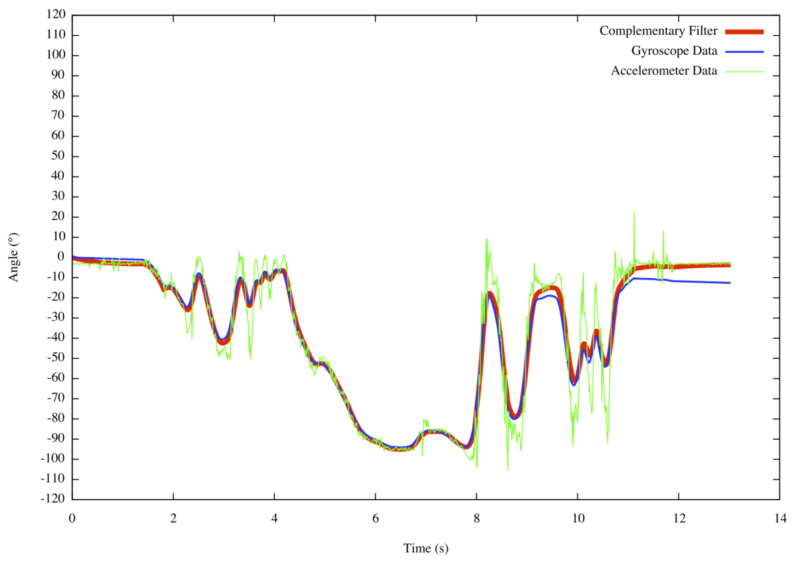
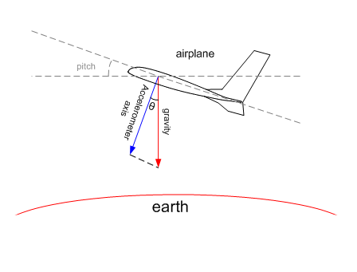
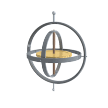
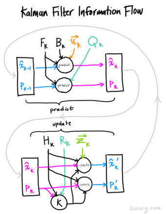
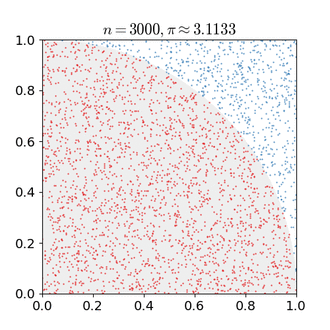

# Accelerated Asynchronous Rao-Blackwellized Particle Filter for POSE estimation of drones

## Context

* Writing my master thesis at the DAWN lab of Stanford
* Group is working on a language for hardware accelerator
* The language and corresponding compiler is Spatial
* The target hardware is FPGA and our own home build CGRA: Plasticine
* Plasticine is build with Spatial in mind and optimized for parralel patterns

## Drones ?

* Main target of Spatial is server, so why drones ?
* Exciting demo for spatial: Spatial can be used for embedded systems too

## Contribution

* A novel fast and accurate algorithm for POSE estimation: ARBPF
* A library to prototype, model and design embedded systems with Spatial in a FP style: **scala-flow**

## Energy bound 

Improved efficiency $\Rightarrow$ Extended flight time

* Hovering rule of thumb: **~150W/Kg**
* A drone like the AF450 from our lab **~100W**
* His FMU (Flight Management Unit), a Pixhawk: **~1-2W**
* Jetson TX2, the latest embedded CUDA board from NVIDIA consumes around: **~8W**

[comment]: # (http://www.starlino.com/power2thrust.html)

## Latency bound

**SLAM** (Software localization and mapping) is critical for **motion planning** and **motion control**.

A critical subproblem of **SLAM** is **POSE** (position estimation)

$$\hat{x_t} = f(x_{t-1}, O_t)$$

* $x_t$ is the state of the drone (including position, attitude (orientation), velocity, etc ...) at time t
* $\hat{x}$ is the estimation of that state
* $O_t$ is the observation of the universe by the drone at time t
* $f$ is the SLAM prediction algorithm

## Computation bound

So far, the available algorithms were limited to low computation requirements.

Thanks to Spatial, we can use filters with better statistical efficiency but higher computational complexity: particle filters 

## Goal

Latency = $\Delta t$ = Max($f$ time, $O$ sample rate)

Reduce $f$ computation time closer to $O$ sample rate.

##

Reduced latency result in more accurate $\hat{x_t}$:

* Smoother control $\Rightarrow$ Less jiggering + "agile" drone
* Better sync between planning and control
* Better collision avoidance $\Rightarrow$ safer for the drone and its surrounding.

## Performance bound

Currently, heavy tasks are usually done:

* On a companion computer on the ground
* Sometimes, offline (after the flight) from the data gathered

Preferable or critical to do them **onboard** and **online**

## The vision

**Accelerating hardware! **

*(A plasticine in every drone)*

* Efficient
* Low-latency
* Performant

# Sensor fusion

## Sensor fusion

Sensor fusion is combining of sensory data or data derived from disparate sources such that the resulting information has less uncertainty than would be possible when these sources were used individually. 

* IMU
* GPS
* LIDAR
* etc ...

## Sensor Filters

From simplest to most complex.

* Complementary filters
* Kalman filters
* Particle Filter
* Rao-blackwellized Particle Fitler

## Complementary filters

Complementary filters come from the complentarity of a HPF and a LPF applied to different sensors

For instance, retrieving the attitude/orientation from the gyroscope + accelerometer

##

## Accelerometer

accelerometer (through g acceleration) no drift but high-variance at high frequency (vibrations, other forces)

Accurate in the long-term: **Low-pass filter**

## Gyroscope

gyroscope drift (because of integral over numerical error accumulate) 

Accurate in the short term: **High-pass filter**

## Drift

* Why does the gyro drift ? Because of the nature of an integration over a gaussian.
* Even if the noise (sensor noise + floating point error) has no bias, it accumulates errors over time.
* Even if there is no error, the integration is discrete $\Rightarrow$ approximation errors
* $$Z \sim N(\mu_X + \mu_Y, \sigma_X^2 + \sigma_Y^2)$$
* For better intuition, see Wiener process $Var(W_t) = t$

## Kalman Filters

Apply bayesian inference to a sensor measurement model and a state-transition model

Estimate the joint state random variables (like position) conditonned on a serie of noisy observation (from the sensors).

##

Basic principle, true state $\mathbf{x}_t$ is a linear noisy process:

$$\mathbf{x}_t = \mathbf{F}_t \mathbf{x}_{t-1} + \mathbf{B}_t \mathbf{u}_t + \mathbf{w}_t $$

* $\mathbf{F}_t$ the state transition model
* $\mathbf{B}_t$ the control-input model
* $\mathbf{u}_t$ the control vector
* $\mathbf{w}_t$ process noise drawn from $\mathbf{w}_t \sim N(0, \mathbf{Q}_k)$

##

The kalman filter keeps track of our estimation of the gaussian random variable $X_t$

($[]_{a|b}$ reads as at time a knowing all observations until and including b)

$$\mathbf{X}_{t|t-1} \sim N(\hat{\mathbf{x}}_{t|t-1}, \mathbf{P}_{t|t-1})$$

* $\mathbf{X}$ state gaussian random variable
* $\hat{\mathbf{x}}$ estimated state mean (best guess)
* $\mathbf{P}$ estimated covariance matrix 

##

Kalman filter proceed in two steps, predict and update:

**Predict**:

*  $\hat{\mathbf{x}}_{t\mid t-1} = \mathbf{F}_k\hat{\mathbf{x}}_{t-1\mid t-1} + \mathbf{B}_t \mathbf{u}_t$
* $\mathbf{P}_{t\mid t-1} =  \mathbf{F}_t \mathbf{P}_{t-1\mid t-1} \mathbf{F}_t^\mathrm{T} + \mathbf{Q}_t$

## Sensor measurements

Our sensor data $z_k$ is also noisy. We assume error is gaussian.

We get a **likelihood** gaussian distribution:

$$\mathbf{Z}_t \sim N(\mathbf{z}_t, \mathbf{R}_t)$$

* $\mathbf{Z}_t$ the random variable of the sensor data at time t
* $\mathbf{z}_t$ the data returned by the sensor at time t
* $\mathbf{R}_t$ the covariance matrix noise from the sensor (known)

## 

**Prior**: $\mathbf{X}_{t|t-1} \sim N(\hat{\mathbf{x}}_{t|t-1}, \mathbf{P}_{t|t-1})$

Now it suffices to combines them to get the **posterior**
$$P(\mathbf{X}_{t|t}) \propto P(\mathbf{X}_{t|t-1}) \cdot P(\mathbf{Z}_t)$$
$$\mathbf{X}_{t|t-1} \cdot \mathbf{Z}_t \sim ?$$

##

* $\mu’ = \mu_0 + \frac{\sigma_0^2 (\mu_1 – \mu_0)} {\sigma_0^2 + \sigma_1^2}$
* ${\sigma’}^2 = \sigma_0^2 – \frac{\sigma_0^4} {\sigma_0^2 + \sigma_1^2}$

## Update 
* $\mathbf{H}_t$ is the obs matrix (obs to state mapping)
* Innovation or measurement residual: $\tilde{\mathbf{y}}_t = \mathbf{z}_t - \mathbf{H}_t\hat{\mathbf{x}}_{t\mid t-1}$
* Innovation covariance: $\mathbf{S}_t = \mathbf{H}_t \mathbf{P}_{t\mid t-1} \mathbf{H}_t^\mathrm{T} + \mathbf{R}_t$
* Optimal Kalman gain: 
$\mathbf{K}_t = \mathbf{P}_{t\mid t-1}\mathbf{H}_t^\mathrm{T} \mathbf{S}_t^{-1}$
* Updated (a posteriori) state estimate: 
$\hat{\mathbf{x}}_{t\mid t} = \hat{\mathbf{x}}_{t\mid t-1} + \mathbf{K}_t\tilde{\mathbf{y}}_t$
* Updated (a posteriori) estimate covariance $\mathbf{P}_{t|t} = (\mathbf{I} - \mathbf{K}_t \mathbf{H}_t) \mathbf{P}_{t|t-1}$

##

## 

The observations can come under many form:

* **motion capture systems like Vicon** (output relative position from 6 cameras around the lab tracking some markers)
* **acceleratometer** (for linear velocity)
* **gyroscope** (for angular velocity)
* magnetometer
* GPS
* Optical flow (camera with some points as referentials)
* LIDAR for altitude or cloudpoints

(In bold the ones I will focus on for this project)

## Non-linearity

Rotations are non-linear operations so we cannot just apply vanilla KF.

Because $Cov(f(X))$ for an arbitrary f has no closed form solution.

Rotations belong to $SO(3)$ and are not a vector space.

## Extended Kalman Filter

**Differentiation to the rescue!**

Extended Kalman filter are an extension of kalman filters for **non linear systems**.

F and H are linearized by an approximation of the first order using Jacobians:

* $\hat{\boldsymbol{x}}_{k|k-1} = f(\hat{\boldsymbol{x}}_{k-1|k-1}, \boldsymbol{u}_{k-1})$
* $\tilde{\boldsymbol{y}}_{k} = \boldsymbol{z}_{k} - h(\hat{\boldsymbol{x}}_{k|k-1})$
* ${{\boldsymbol{F}_{k-1}}} = \left . \frac{\partial f}{\partial \boldsymbol{x} } \right \vert _{\hat{\boldsymbol{x}}_{k-1|k-1},\boldsymbol{u}_{k-1}}$
* ${{\boldsymbol{H}_{k}}} = \left . \frac{\partial h}{\partial \boldsymbol{x} } \right \vert _{\hat{\boldsymbol{x}}_{k|k-1}}$

##

But approximation of the first order are not appropriate for complex transformations. 

Linear transformation of the covariance $cov(FX) = FSF^t$ is often a very poor approximation.

## Quaternions (optional)

Quaternions are an extensions of complex numbers but with 2 extra dimensions 
$$i^2=j^2=j^2=ijk=-1$$

Unit quaternions, also known as versors, can be used to represent orientations and rotations in 3D.

Compared to Euler Angles, they are easier to compose and avoid gimbal lock.

## Particle filter

Particle filters = sequential monte carlo 

estimate the evolution of a distribution by applying transformation corresponding to sampled measurements

importance sampling keep tracks of the relative importance of each particle

Our particle contains our state. We sample different possible true measurement from the measurements and their known noise.

## Monte Carlo method

Monte Carlo methods are a broad class of computational algorithms that rely on repeated random sampling to obtain numerical results

The more particles, the better estimation of the distribution

**Problem**: The number of needed particles grows exponentially with the dimension of the state

## Rao-blackwellized Particle Filter

The particle now contains a state and a latent variable

The state is conditionnaly gaussian given the latent variable

Our latent variable here is our attitude.

importance sampling now use the likelihood derived from the KF for the linear part.

Accurate as a particle filter but computationaly efficient as a KF for the linear part.

## Asynchronosity

The different sensors have different sampling rate

We use asynchronous kalman update when when we need to update the kalman filter

## Other applications

* VR headsets also include an IMU whose reactivity is crucial for immersion
* Not only drones but the whole field of robotic need POSE.
