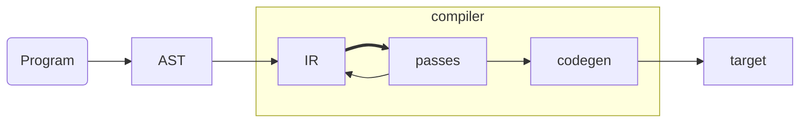

# An interpreter for spatial

## Spatial: An Hardware Description Language

Building applications is only made possible thanks to the many layers of abstractions that start fundamentally at the level of electrons. It is easy to forget how much of an exceptional feat of engineering.


An Hardware Description Language (HDL) is used to describe the circuits on which applications runs on. A Software programming language is used to describe the applications themselves. Fundamentally, their purpose is different. But with a sufficient level of abstraction, they share many similarities. 

`c := a + b` would translate in software by an instruction to store in the memory (stack or heap) the sum of `a` and `b` stored themselves somewhere in memory. In hardware, depending on whether `c` represents a wire, a register, a memory location in SRAM or DRAM, the circuit is changed. However, from the user perspective, the source code is the same. One could think that it would be possible to write Hardware the same way than Software, but it is delusional. Some concepts are tied to the intrinsic nature of Hardware and inexpressible in the world of Software. A DSL that would abstract away those differences would result in a great loss of control for the user. Nevertheless, with the right level of abstraction it is possible to at least bridge the gap to a level satisfying for both the Software and Hardware engineers. This is the motivation behind Spatial.

Spatial is an (HDL) born out of the difficulties and complexity of doing Hardware. An HDL compiles to RTL which is equivalent to assembly in the software world and then the RTL is synthesized as Hardware (either as ASIC or as a bitstream reconfiguration data). The current alternatives available are Verilog, VHDL, Chisel and many others. What set apart Spatial from the crowd is that Spatial has a higher level of abstraction by leveraging parallel patterns and abstracting control flows as language constructs. Parallel patterns and control flows are detailed in Part IV.

Spatial is both a language and a compiler. The Spatial language is embedded in scala as a domain specific language (DSL). The compiler is defined as Argon traversals, transformers and codegens.

## Argon

Spatial is built on top of Argon, a fork of Lightweight Modular Staging (LMS). Argon and LMS are scala libraries that enable staged programming (or also called staged meta-programming). Argon lets user write meta-programs that are programs generators: programs that generate other programs. 

Using Argon, language designers can specify a DSL and write their custom compiler for it:

- **two-staged**: There is only a single meta-stage and a single object-stage. The idea behind Argon is that the meta-program is constructing an Intermediate Representation (IR) programmatically in Scala through the frontend DSL, transform that IR and finally codegen the object program. All of this happening at runtime.
- **heterogenous**: The meta-program is in Scala but the generated meta-program does not have to be in Scala as well. For instance, for FPGA, the target language is Chisel.
- **typed**: The DSL is typed which ensure that Scala can typecheck the construction of the IR. Furthermore, the IR is itself typed. The IR being typed ensure that the DSL author write sound DSL.
- **automatic staging annotations**: The staging annotations are part of the frontend DSL. Implicit conversions exists from unstaged type to staged types. The staging annotations exists under the form of typeclass instances and inheritance.

Indeed, for a type to be considered a staged type, it must inherit from `MetaAny` and have an existing typeclass instance of `Type`. The justification behind the dual proof of membership is that the `Type` view bound is more elegant to constrain on in most cases, but suffer from the fact that it is impossible to specialize method such that they treat differently staged and unstaged types. Only inheritance ensure correct dispatching of methods according to whether the argument is staged or not. Implementing the typeclass and dual proof of membership was among our contribution to argon.

```scala
trait MetaAny
trait Type[A]

case class Staged() extends MetaAny
case class Unstaged()

implicit object StagedInstance extends Type[Staged]

object Attempt1 {
	//equivalent to def equal(x: Any, y: Any) = 
	def equal[A, B](x: A, y: B) = 
		1

	def equal[A: Type, B: Type](x: A, y: B) = 
		2	
}

object Attempt2 {
	def equal(x: Any, y: Any) = 
		1

	def equal(x: MetaAny, y: MetaAny) = 
		2
}

Attempt1.equal(Unstaged(), Unstaged())
//return error: ambiguous reference to overloaded definition
Attempt1.equal(Staged(), Staged())
//return error: ambiguous reference to overloaded definition

Attempt2.equal(Unstaged(), Unstaged())
//return 1 as expected
Attempt2.equal(Staged(), Staged())
//return 2 as expected
```


## Argon meta-program flow



## Simulation in Spatial

## Benefits of the interpreter

Building an interpreter for Spatial was a requirement for having a spatial integration in scala-flow. But it also benefits the whole spatial ecosystem. Indeed, an interpreter encourage the user to have more interactions with the language.

## Interpreter

- **runtime generator**:
