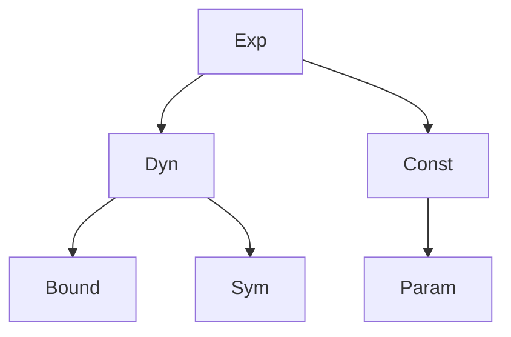
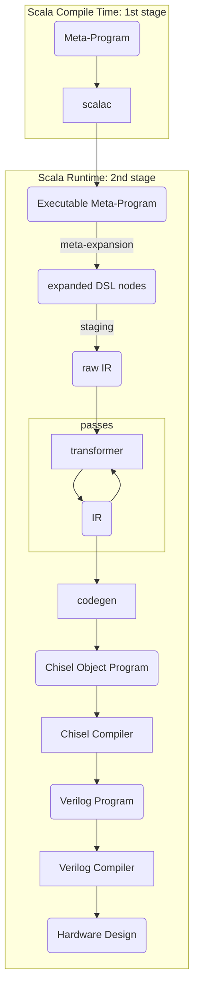
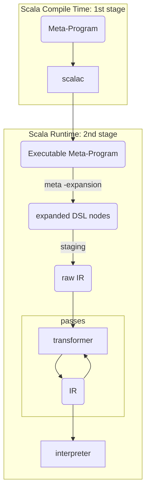

# An interpreter for Spatial

## Spatial: A Hardware Description Language

Building applications is only made possible thanks to the many layers of abstractions that start fundamentally at a rudimentary level. It is easy to forget how much of an exceptional feat of engineering is running an application.


An Hardware Description Language (HDL) is used to describe the circuits on which applications run on. A Software programming language describe the applications themselves (imperative languages focus on the how, and functional programming languages on the what). Fundamentally, their purpose is different. But with a sufficient level of abstraction, they share many similarities. 

`c := a + b` would translate in software by an instruction to store in the memory (stack or heap) the sum of `a` and `b`, stored themselves somewhere else in memory. In hardware, depending on whether `c` represents a wire, a register, a memory location in SRAM or DRAM, the circuit is changed. However, from the user perspective, the source code looks the same. One could think that it would be possible to write Hardware exactly the same way as Software, but this is delusional. Some concepts are tied to the intrinsic nature of Hardware and hopelessly inexpressible in the world of Software. A DSL that would abstract away those differences would result in a great loss of control for the user. Nevertheless, with the right level of abstraction it is possible to at least bridge the gap to a level satisfying for both the Software and Hardware engineers. This is the motivation behind Spatial.

Spatial is hardware description language (HDL) born out of the difficulties and complexity of designing Hardware. An HDL compiles to Register-Transfer Level (RTL), an equivalent to assembly in the software world. Then the RTL is synthesized as Hardware (either as Application-specific integrated circuit (ASIC) or as a bitstream reconfiguration data). The current alternatives for HDLs available are Verilog, VHDL, HLS, Chisel and many others. What sets apart Spatial from the crowd is that Spatial has a higher level of abstraction by leveraging parallel patterns, abstracting control flows as language constructs and automatic timing and banking. Spatial targets "spatial architectures" constituted currently of the Field-Programmable Gate Array (FPGA) and a Coarse Grain Reconfigurable Arrays (CGRA) developed also by the lab, Plasticine. Chisel is actually the target language of Spatial for the FPGA backend. Parallel patterns and control flows are detailed in Part IV.

Spatial is at the same time a language, an Intermediate Representation (IR)  and a compiler. The Spatial language is embedded in Scala as a domain specific language (DSL). The compiler is built around Argon as a set custom defined traversals, transformers and codegens. The Spatial compiler is referred to as "the staging compiler" to differentiate it from scalac, the Scala compiler.

## Argon

Spatial is built on top of Argon, a fork of Lightweight Modular Staging (LMS). Argon and LMS are Scala libraries that enable staged programming (also called staged meta-programming). Thanks to Argon, language designers can specify a DSL and a custom compiler. In this DSL, users can write and run meta-programs and more specifically program generators: programs that generate other programs. 

Argon is:

- **two-staged**: There is only a single meta-stage and a single object-stage. The idea behind Argon is that the meta-program is constructing an IR programmatically in Scala through the frontend DSL, transforms that IR and finally codegens the object program. All of this happening at runtime.
- **heterogenous**: The meta-program is in Scala but the generated meta-program does not have to be in Scala as well. For instance, for FPGA, the target language is both C++ and Chisel (an embedded DSL in Scala).
- **typed**: The DSL is typed which enables Scala to typecheck the construction of the IR. Furthermore, the IR is itself typed. The IR being typed ensures that language designers write sound DSLs and corresponding IR.
- **automatic staging annotations**: Staging annotations are part of the frontend DSL. Implicit conversions exist from unstaged types to staged types. Staging annotations exists under the form of typeclass instances and inheritance.

## Staged type

A staged type is a type that belongs to the specified DSL and has a staging annotation. Only instances of a staged type will be transformed into the initial IR.

Indeed, for a type to be considered a staged type, it must inherit from `MetaAny` and have an existing typeclass instance of `Type`. The justification behind the dual proof of membership is that the `Type` context bound is more elegant to work with in most cases. Nevertheless, it suffers that it is impossible to specialize methods such that they treat differently staged and unstaged types. Only inheritance can guarantee correct dispatching of methods according to whether the argument is staged or not. Implementing the typeclass and dual proof of membership was among the contributions of this work to Argon.

```Scala
trait MetaAny
trait Type[A]

case class Staged() extends MetaAny
case class Unstaged()

implicit object StagedInstance extends Type[Staged]

object Attempt1 {
	//equivalent to def equal(x: Any, y: Any) = 
	def equal[A, B](x: A, y: B) = 
		1

	def equal[A: Type, B: Type](x: A, y: B) = 
		2	
}

object Attempt2 {
	def equal(x: Any, y: Any) = 
		1

	def equal(x: MetaAny, y: MetaAny) = 
		2
}

Attempt1.equal(Unstaged(), Unstaged())
//return error: ambiguous reference to overloaded definition
Attempt1.equal(Staged(), Staged())
//return error: ambiguous reference to overloaded definition

Attempt2.equal(Unstaged(), Unstaged())
//return 1 as expected
Attempt2.equal(Staged(), Staged())
//return 2 as expected
```


## IR

The IR in Argon is based on a "sea-of-nodes" representation of the object-program. The "sea-of-nodes" representation is a graph containing all kind of dependencies and anti-dependencies between the nodes of the IR. The IR is the data manipulated by the staging compiler and is transformed after each pass. The IR nodes are staged Exp values. Exp is an algebraic data type (ADT), more precisely a sum type of the following form:



- Consts are staged expressions whose value is known during staging. Since the staging compiler is aware of the value, some optimizations can be applied. For instance, constant folding can simplify the object-program considerably.
- Params are specialized Consts whose purpose is specifically for Design Space Exploration (DSE). DSE refers to the activity of exploring design alternatives prior to implementation. Users define Params as range of values and, within them, the compiler will attempt to find the best trade-off in terms of area and throughput [@koeplinger_automatic_2016] among others.
- Sym stands for "Symbol". Syms are always associated with Defs. Def is a library author defined ADT. More precisely, it is the sum type of all the product type of library author defined named staged functions. Defs take a staged type parameter and are products of other staged type only.
- Bounds are similar to Syms but are bounded by a scope. They represent staged local variables.
- Dyns are the complement of Consts and represent any staged expressions whose value is dynamic, not known during staging. It is the sum type of Bound and Sym.


## Transformer and traversal

A Traversal is a pass of the compiler that traverses (iterates through) the entire IR and applies an arbitrary function. It can either be used to check if the IR is well-formed or to gather some logs and stats about the current state of the IR. Since the IR is a "sea-of-nodes", it has to be linearized first by a scheduler as a sequence of nodes. Codegen is defined as a traversal.

A Transformer is a Traversal that not only traverses the IR but also transforms it into a new IR.

## Language virtualization

Using Scala macros, some of the primitive syntax constructions and keywords of Scala are made interoperable with Spatial staged types. The following parts are currently virtualized (where cond is an `Argon.Boolean`):

- `if (cond) expr1 else expr2`
- `while (cond) expr1` (in progress)

Below, a and b are `Any`: 

- `a == b`
- `a != b`
- `a.toString`
- `a + b` 


## Source Context

All usage of the DSL in the meta-program is accompanied with an implicit macro expansion of a `SourceContext` object. That object is passed along in the IR such that all IR nodes have an associated `SourceContext`. That object contains context information such as the line number, the position in the line, the method name, and the content of the line on which the DSL node at the origin is located. This is how the interpreter can display the surrounding context of each interpreted instruction.

## Meta-expansion

Since DSLs are embedded in Scala, it is possible to use the Scala language as a meta-programming tool directly. The construction of the IR is done in an imperative manner and only staged types are visible to the staging compiler. 

```Scala
List.tabulate(100)(_ => Reg[Int])
```
will be meta-expanded as the creation of 100 Registers.

For the same reason, when named Scala functions are defined and called inside a Spatial program, the function call is not staged but inlined during meta-expansion.

```Scala
def f(x: argon.Int) = 
	//very long body
	
val b: argon.Boolean = ...

//thanks to language virtualization, this is syntaxic sugar for
//ifThenElse(b, f(0), f(1)) where ifThenElse is an argon defined
//function
if (b) 
	f(0)
else 
	f(1)
```
is expanded into 
```Scala
val b: argon.Boolean = ...

if (b)
	//very long body involving 0
else 
	//very long body involving 1
```

## Codegen



After the IR has been transformed through all the passes, it is sufficiently refined to be processed by the codegen. The codegen is implemented as a traversal which, after linearization by scheduling, visits each item of a sequence of pair of `Sym` and `Def`. Each pair is transformed according to the `Def` as a string in the format of the target language and written to the output file. `Def` nodes have versatile meaning since they encompass the full range of the language. Language designers add `Def` nodes to their language in a modular manner. For Spatial, each kind of data type have an associated set of `Defs` which are defined in their own modules and mixed-in incrementally to the compiler. For instance, `argon.Boolean` have among others `Def` nodes that can be simplified as:

- `case class Not (a: Exp[argon.Boolean])` ` extends Def[argon.Boolean]`
- `case class And (a: Exp[argon.Boolean], b: Exp[argon.Boolean])` ` extends Def[argon.Boolean]`
- `case class Or  (a: Exp[argon.Boolean], b: Exp[argon.Boolean])` ` extends Def[argon.Boolean]`

## Staging compiler flow

The full work flow of program staging through Argon is as follows: The meta-program is first compiled by scalac as an "executable meta-program". When this executable is run, it starts meta-expansion and as a result, constructs an initial IR. That initial IR goes through the different transformers which correspond to the passes of the staging compiler. Once the IR is sufficiently refined by having been through all the passes, it is codegen in the target language.

## Simulation in Spatial

Synthesizing takes time, many days in some instances. It is beneficial for users to have access to an early proof of correctness of the program's logic. This justifies the existence of a simulation mode. Before the development of the interpreter, the simulation mode was a codegen whose target was a Scala program of the simulated circuit logic. The resulting Scala program is self-contained and reproduces the execution of the hardware design, but only to some extent. To mirror exactly the execution of the design, it is required to write a cycle accurate simulator. It is possible but not simple, especially writing it in a codegen form. Furthermore, a cycle-accurate simulator already exists: Synopsys Verilog Compiler Simulator (VCS). However, VCS takes Verilog as input. Hence, it cannot leverage the richer information from the DSL and the debugging cannot be enhanced with Spatial annotations (for instance with `SourceContext`). Finally, writing a compiler is more complex than writing an equivalent interpreter.

## Benefits of the interpreter



Building an interpreter for Spatial was a requirement of having a Spatial integration in scala-flow. Furthermore, it is a requirement to integrate a Spatial simulator into any external library. It also benefits the Spatial ecosystem as a whole. Indeed, an interpreter encourages the user to have more interactions with the language and working in increasing complexity iterations thanks to fast feedback since the work flow involves less steps, is faster to launch and is more tightly integrated with Spatial (the interpreter has access to `SourceContext`, among others). The interpreter is not yet cycle-accurate, but this is planned as future work.

## Interpreter

The interpreter is implemented as an alternative to codegen. The largest benefit of this approach is that the interpreter sees an IR that has already been processed and can mirror closely the codegen and the intended evaluation of the generated code. Moreover, if one of the passes fails or throw an error, then running the interpreter will also halt at that error.


<script type="text/javascript" src="https://asciinema.org/a/QdIFZlzj3M9wf3TzF79AHjIc5.js" id="asciicast-QdIFZlzj3M9wf3TzF79AHjIc5" async></script>

## Usage

Any Spatial application can be run using the CLI flag `--interpreter`. If used in combination with the flag `-v` (for "verbose"), each instruction interpretation will display the full state of the interpreter. If used without any verbosity flag, then only the name and number of the instruction is displayed at each step. Finally, if the flag `-q` (for "quiet") is used, then nothing is displayed during the interpreter execution. At all verbosity levels, the state of the interpreter includes the result in the output bus, if any, is displayed after the last instruction has been interpreted.

## Debugging nodes

The Argon DSL has been extended with the static methods `breakpoint()` and `exit()`. The method `breakpoint()` pauses the interpreter and displays its internal state. A key must be pressed to resume the interpreter evaluation.

The method `exit()` stops the evaluation of the interpreter.

## Interpreter stream

In addition to standard applications being able to run as-is, applications that rely on streams have been given some specific attention in order to ease their usage with the interpreter. Indeed, being able to run a Spatial application in the same runtime as the application's compilation gives the means to do in-memory transfer between the meta-program (or the larger surrounding program), to the object program to the input streams. This is made easy by using the following pattern:

- The meta-program itself must be written in a trait extending `SpatialStream`
- The main entry point of the interpreter mix-ins the meta-program definition trait with `SpatialStreamInterpreter` and declares the input buses as well their content at start and the output buses.
- The main entry point for synthesizing mix-ins the meta-program definition trait with `SpatialStreamCompiler`

An example is provided below:

```Scala
trait StreamInOutAdd extends SpatialStream {

  @virtualize def spatial() = {
    val in  = StreamIn[Int](In1)
    val out = StreamOut[Int](Out1)    
    Accel(*) {
      out := in + 4
      breakpoint
    }
  }
}


object StreamInOutAddInterpreter extends StreamInOutAdd
	with SpatialStreamInterpreter {

  val outs = List(Out1)

  val inputs = collection.immutable.Map[Bus, List[MetaAny[_]]](
    (In1 -> List[Int](1, 2, 3, 6))
  )

}

object StreamInOutAddCompiler extends StreamInOutAdd
	with SpatialStreamCompiler
```

In-memory transfer was essential in integrating the spatial interpreter with scala-flow.

## Implementation

The IR given to the interpreter follows a static single assignment (SSA) form. The interpreter is implemented as a traversal which, after linearization by scheduling, visits a sequence of pair of `Sym` and `Def`. The interpreter core is a central memory that contains the values of all symbols, and an auxiliary memory that contains the values of the temporary bounds. The pair of `Sym` and `Def` is processed by evaluating the `Def` node through modular extensions of the interpreter that mirror the modular partitioning of the IR itself. Once evaluated, the result is stored in the central memory with index the `Sym`. An `eval` function is used as an auxiliary method for the evaluation of the nodes. It takes as argument an `Exp` and can be simplified as:

- if the argument is a `Sym`, retrieve the corresponding values in the central memory
- if the argument is a `Const`, return the value of the Const

Here is a very simplified example

```scala
val a: argon.Int = ...
val b = 2 + a
b * 4 * b

//becomes roughly after staging and linearization
Seq(
	(x1, Add(Const(2), a)),
	(x2, Mult(x1, Const(4))),
	(x3, Mult(x2, x1))
)

//let's assume the central memory starts with:
a <- 1
//the interpreter will evaluates the seq as
x1 <- eval(2) + eval(a) = 2 + 1 = 3
x2 <- eval(x1) * eval(4) = 3 * 4 = 12
x3 <- eval(x2) * eval(x1) = 12 * 3 = 46
```

Blocks and control flows handling rely on node-defined traversals of their inner body. Loops with various parallelizing factors are handled using an interpreter-specific scheduler.

The currently implemented modules of the Spatial IR for the interpreter are:

- `Controllers  `
- `FileIOs		`
- `Debuggings	`
- `HostTransfers`
- `Regs			`
- `Strings		`
- `FixPts		`
- `FltPts		`
- `Arrays		`
- `Streams		`
- `Structs		`
- `SRAMs		`
- `DRAMs		`
- `Booleans		`
- `Counters		`
- `Vectors		`
- `FIFOs		`
- `FSMs			`
- `RegFiles		`
- `Maths		`
- `LUTs         `


## Conclusion

The addition of an interpreter to Argon and Spatial improves the whole ecosystem and offer new possibilities. Maintenance and extension of the simulator will be easier to write in an interpreter form, especially if a cycle-accurate simulator is developed. It is hoped that the interpreter will prove itself useful in the workflow of all app developers and become a core element of Spatial. 
