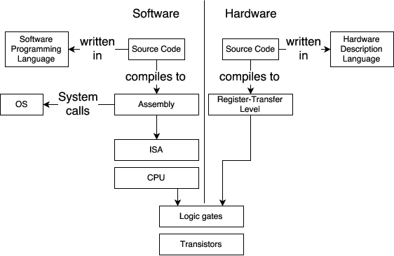
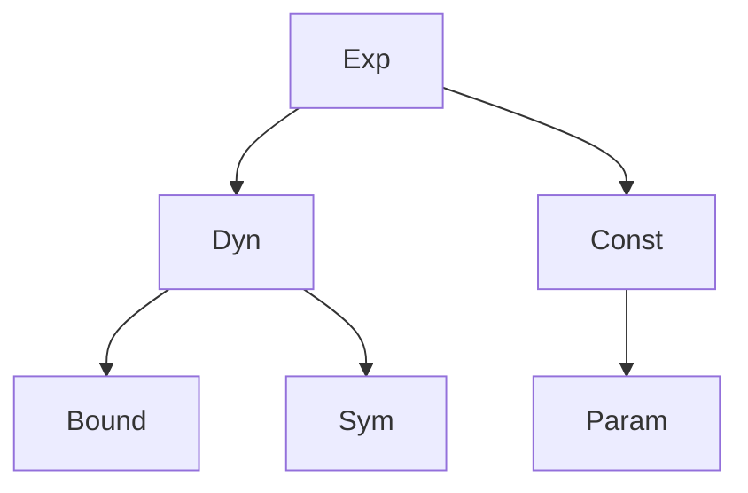
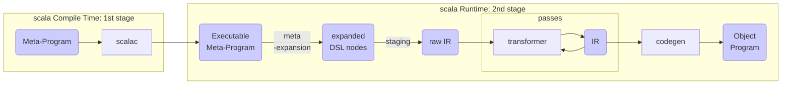
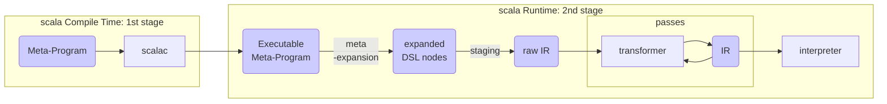

### About

This post is the part III out of IV of my [master thesis](assets/thesis.png) at the [DAWN lab](http://dawn.cs.stanford.edu/), Stanford, under [Prof. Kunle](http://arsenalfc.stanford.edu/kunle) and [Prof. Odersky](http://lampwww.epfl.ch/~odersky/) supervision. The central themes of this thesis are sensor fusion and spatial, an hardware description language (Verilog is also one, but tedious). 

This part is about the spatial language and the development of its interpreter.


# An interpreter for spatial

## Spatial: An Hardware Description Language

Building applications is only made possible thanks to the many layers of abstractions that start fundamentally at the level of electrons. It is easy to forget how much of an exceptional feat of engineering.



An Hardware Description Language (HDL) is used to describe the circuits on which applications runs on. A Software programming language is used to describe the applications themselves. Fundamentally, their purpose is different. But with a sufficient level of abstraction, they share many similarities. 

`c := a + b` would translate in software by an instruction to store in the memory (stack or heap) the sum of `a` and `b` stored themselves somewhere in memory. In hardware, depending on whether `c` represents a wire, a register, a memory location in SRAM or DRAM, the circuit is changed. However, from the user perspective, the source code is the same. One could think that it would be possible to write Hardware the same way than Software, but it is delusional. Some concepts are tied to the intrinsic nature of Hardware and inexpressible in the world of Software. A DSL that would abstract away those differences would result in a great loss of control for the user. Nevertheless, with the right level of abstraction it is possible to at least bridge the gap to a level satisfying for both the Software and Hardware engineers. This is the motivation behind Spatial.

Spatial is an (HDL) born out of the difficulties and complexity of doing Hardware. An HDL compiles to RTL which is equivalent to assembly in the software world and then the RTL is synthesized as Hardware (either as ASIC or as a bitstream reconfiguration data). The current alternatives available are Verilog, VHDL, Chisel and many others. What set apart Spatial from the crowd is that Spatial has a higher level of abstraction by leveraging parallel patterns and abstracting control flows as language constructs. Parallel patterns and control flows are detailed in Part IV.

Spatial is at the same time a language, an Intermediate Representation (IR)  and a compiler. The Spatial language is embedded in scala as a domain specific language (DSL). The compiler is defined as Argon traversals, transformers and codegens and referred to as "the staging compiler".

## Argon

Spatial is built on top of Argon, a fork of Lightweight Modular Staging (LMS). Argon and LMS are scala libraries that enable staged programming (or also called staged meta-programming). Argon lets user write meta-programs that are programs generators: programs that generate other programs. 

Using Argon, language designers can specify a DSL and write their custom compiler for it:

- **two-staged**: There is only a single meta-stage and a single object-stage. The idea behind Argon is that the meta-program is constructing an IR programmatically in Scala through the frontend DSL, transform that IR and finally codegen the object program. All of this happening at runtime.
- **heterogenous**: The meta-program is in Scala but the generated meta-program does not have to be in Scala as well. For instance, for FPGA, the target language is Chisel.
- **typed**: The DSL is typed which ensure that Scala can typecheck the construction of the IR. Furthermore, the IR is itself typed. The IR being typed ensure that language authors write sound DSL, IR and DSL to IR transformations.
- **automatic staging annotations**: The staging annotations are part of the frontend DSL. Implicit conversions exists from unstaged type to staged types. The staging annotations exists under the form of typeclass instances and inheritance.

## Staged type

A staged type is a type that belongs to the specified DSL and has a staging annotation. Only instances of a staged type will be transformed into the initial IR.

**TODO**

Indeed, for a type to be considered a staged type, it must inherit from `MetaAny` and have an existing typeclass instance of `Type`. The justification behind the dual proof of membership is that the `Type` view bound is more elegant to constrain on in most cases, but suffer from the fact that it is impossible to specialize method such that they treat differently staged and unstaged types. Only inheritance ensure correct dispatching of methods according to whether the argument is staged or not. Implementing the typeclass and dual proof of membership was among our contribution to argon.

```scala
trait MetaAny
trait Type[A]

case class Staged() extends MetaAny
case class Unstaged()

implicit object StagedInstance extends Type[Staged]

object Attempt1 {
	//equivalent to def equal(x: Any, y: Any) = 
	def equal[A, B](x: A, y: B) = 
		1

	def equal[A: Type, B: Type](x: A, y: B) = 
		2	
}

object Attempt2 {
	def equal(x: Any, y: Any) = 
		1

	def equal(x: MetaAny, y: MetaAny) = 
		2
}

Attempt1.equal(Unstaged(), Unstaged())
//return error: ambiguous reference to overloaded definition
Attempt1.equal(Staged(), Staged())
//return error: ambiguous reference to overloaded definition

Attempt2.equal(Unstaged(), Unstaged())
//return 1 as expected
Attempt2.equal(Staged(), Staged())
//return 2 as expected
```


## IR

The IR in argon is a "sea-of-nodes" representation of the object-program while it is going through the different passes of the staging compiler. The IR nodes are leaves of the Exp tree. The Exp tree leaves are:

**TODO**

- A
- B
- C



## Transformer and traversal

**TODO**

## Meta-expansion

Since the DSL are embedded in Scala, it is possible to use the scala language as a meta-programming tool.

**TODO**

## Codegen

After the IR has been transformed through all the passes, it is sufficiently processed to go directly through the codegen. The codegen is a traversal

**TODO**


## Argon staged programming flow



## Simulation in Spatial

## Benefits of the interpreter

Building an interpreter for Spatial was a requirement for having a spatial integration in scala-flow. But it also benefits the whole spatial ecosystem. Indeed, an interpreter encourage the user to have more interactions with the language.

## Interpreter

A compiler ...

An interpreter ...

Here, the interpreter is implemented as an alternative to codegen




The largest benefit of this approach is that the interpreter sees an IR that has already been processed and can mirror more closely what would the generated code do. If one of the pass fails or throw an error, then running the interpreter will also show that error.

The currently implemented modules of the Spatial IR for the interpreter are:

- `Controllers  `
- `FileIOs		`
- `Debuggings	`
- `HostTransfers`
- `Regs			`
- `Strings		`
- `FixPts		`
- `FltPts		`
- `Arrays		`
- `Streams		`
- `Structs		`
- `SRAMs		`
- `DRAMs		`
- `Booleans		`
- `Counters		`
- `Vectors		`
- `FIFOs		`
- `FSMs			`
- `RegFiles		`
- `Maths		`
- `LUTs         `

## Debugging

Breakpoint and exit

**TODO**

## Implementation

The interpreter core is a central memory that contain the value of all symbols, and an auxilliary memory that contain the temporary bound values.

## Usage

**TODO**


## References

